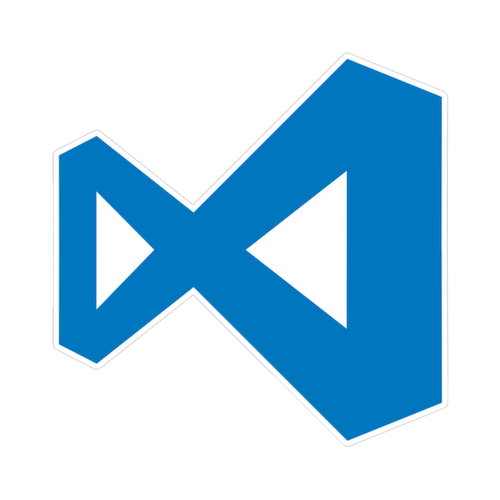
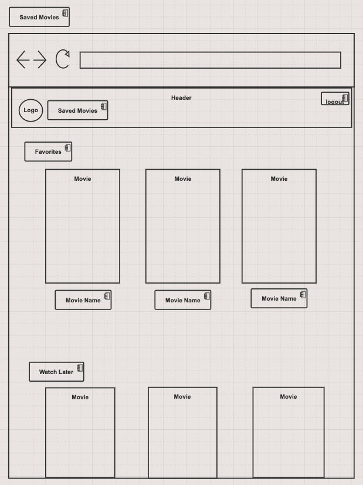

# Popcorn and Flicks
  With Popcorn and Flicks, finding a movie to watch has never been so easy. Popcorn and Flicks is a movie application that will
  help users find their favorite movies, write notes about them, and find new movies to watch. Users will be able to search through popular movies that week, filter through movies by genre, read a description of a movie, write/delete notes under each movie, and save movies to their favorites or watch later. 

## Table of Contents
  * [Project Requirements and Features List](#project-requirements-and-features-list)
  * [Technologies Used](#technologies-used)
  * [Installing and Launching Popcorn and Flicks](#instructions-for-installing-Popcorn-and-Flicks)
  * [Appendix 1: Planning Documentation](#appendix-1-planning-documentation)
    * [Entity Relationship Diagrams](#entity-relationship-diagram)
    * [Wireframes](#wireframes)
  * [Appendix 2: Set Up Instructions](#appendix-2-set-up-instructions)

## Project Requirements and Features List
### Get Started
After a user registers an account with Popcorn and Flicks, they will be taken to a home page that will show all of the popular movies that week. By clicking on a movie poster or movie title, the user is taken to another page that displays a poster for that movie, a plot overview, a favorite and watch later button, and a section to write notes.

### Saving Movies to Favorites and Watch Later
Once a user has decided on which movie they want to save, on the home page they can simply press the heart or the book mark button on the movie poster to save the movie to either favorites or watch later. If the user is in a movie's deatails, the same favorite and watch later buttons will appear below the movie's overview. In order for the user to see the movies that they have saved, they must press the saved button up in the nav bar and it will take them to a page where all of their favorited and watch later choices are rendered. A user can take movies off of their lists by going into the movie's details and unclicking either the favorite button or the watch later button.

## Technologies Used
  ### Development Languages and Libraries
  </img> 

  ### Development Tools
  </img> </img>

## Instructions for Installing Popcorn and Flicks
  To launch the Popcorn and Flicks app, you will need to have access to command line tools, node package manager, JSON Server. If you do not have access to any of these tools, you can find instructions for installing them in the [Appendix.](#appendix-2-set-up-instructions)

  Clone this repo on you personal machine using the following command
  ```sh
    git@github.com:TKomrij/popcornAndFlicksCapstone.git
  ```

  Install the NPM dependencies for this project using the following commands
  ```sh
    cd popcorn-and-flicks
    npm install
  ```

  From your terminal window, type
  ```sh
    npm start
  ```

  Now that the server is up and running, you can open an internet browser and access the application
  ```sh
    http://localhost:8080/
  ```

 ### Congratulations you are now experiencing Popcorn and Flicks!

  ## Appendix 1: Planning Documentation

  ### Entity Relationship Diagram
  
  
  ### Wireframes/ Mockups
  </img> 
  </img>
  </img> </img>
  </img> 


 ## Appendix 2: Set Up Instructions

  You will need to have command line tools installed for your computer to use terminal commands.

  Linux/ Windows users, please visit the [Git page](https://git-scm.com/book/en/v2/Getting-Started-Installing-Git) and follow the instructions for set up

  Mac users follow the instructions below

  Open your terminal and type
  ```sh
    git --version
  ```

  You will now need to configure your git account. In the terminal window, type:
  ```sh
    git config -global user.name "Your Name"
    git config -global user.email "Your Email"
  ```

  If you do not have Node.js installed on your machine, visit the [Node.js Download Page](https://nodejs.org/en/download/) and  follow the instructions. To ensure that it is installed correctly, in your terminal window, type
  ```sh
    echo $PATH
  ```
  Ensure that the result has the following in the $PATH
  ```sh
    /usr/local/bin
    or
    /usr/local/bin:/usr/bin:/bin:/usr/sbin:/sbin
  ```

  Now you can follow the [installation instructions](#instructions-for-installing-Popcorn-and-Flicks) to get Simplified Supper up and running on your machine.

  This project was bootstrapped with [Create React App](https://github.com/facebook/create-react-app).


